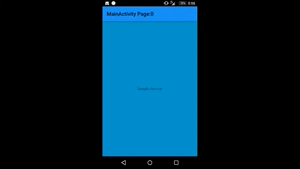
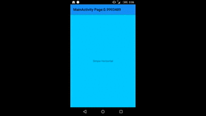
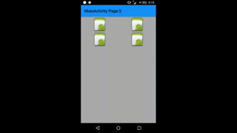

# AndroidPageLayout
[](https://www.nuget.org/packages/Meilcli.Android.PageLayout/)  
PageLayout for Xamarin.Android

This layout is ViewPager-like layout but non used Adapter




## Required
- MonoAndroid7.0 (if older version? should update Xamarin.Android)

## Install
~~~
Install-Package Meilcli.Android.PageLayout
~~~

## How diferrent from ViewPager?

- Non Adapter! Page's view is adding while containing in PageLayout
- Support multiple page.
- Support NestedScrollView in Page (PageLayout implements NestedScrollingParent)
- Support vertical and horizontal orientation.

## Usage
How use in your Project? see [sample AndroidPageLayout.App](/AndroidPageLayout.App)!!!

### How add to layout.xml?
First, add this code to root layout in xml
 
```xml
xmlns:app="http://schemas.android.com/apk/res-auto"
```

Second, add PageLayout and child view in xml

```xml
<androidpagelayout.PageLayout 
    android:layout_width="match_parent"
    android:layout_height="match_parent"
    app:page_orientation="vertical">
    <TextView
        android:layout_width="match_parent"
        android:layout_height="match_parent"
        android:text="Page1"
        android:gravity="center"
        app:page_view="true" />
</androidpagelayout.PageLayout>
```

### How customize orientation?
Set page_orientation in PageLayout
```
app:page_orientation="vertical"
app:page_orientation="horizontal"
```

### How add Page in PageLayout?
Set page_view to true in PageLayout's child view
```
app:page_view="true"
```

### How show multiple page?
Set page_multi_size in PageLayout
```
app:page_multi_size="2"
```

### Activity Transition and Twitter-like image viewer 


See sample
- [TwitterLikeImageViewerActivity](/AndroidPageLayout.App/TwitterLikeImageViewerActivity.cs)
- [TwitterLikeImageViewer.axml](/AndroidPageLayout.App/Resources/layout/TwitterLikeImageViewer.axml)
- [Styles.xml (for lolipop)](/AndroidPageLayout.App/Resources/values-v21/Styles.xml)

## License
This library is under MIT License.

And, this library use [SlideLayout](https://github.com/MeilCli/AndroidSlideLayout)
